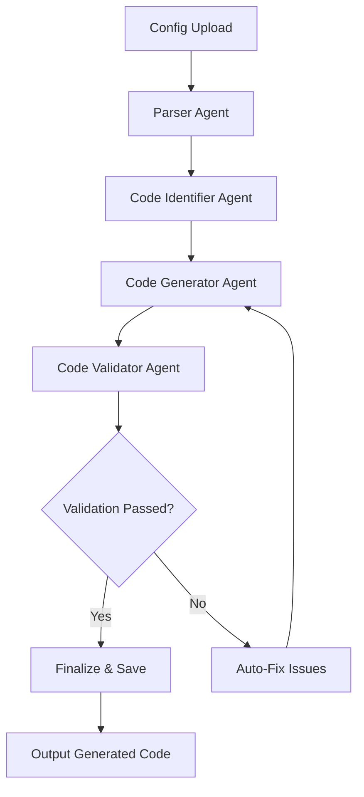

# AI Code Generator

🤖 **Automated Code Modification using Intelligent Agents**

An AI-powered system that automatically modifies data loading processes by analyzing configuration files and intelligently updating target code files using multi-agent workflows.

## 🌟 Features

- **Configuration-Driven**: Simply upload a JSON configuration file to specify desired changes
- **Intelligent File Detection**: Automatically identifies files that need modifications
- **Multi-Agent Architecture**: Uses specialized AI agents for different tasks
- **Code Validation**: Validates and fixes generated code automatically
- **Interactive Mode**: User-friendly CLI interface for guided workflows
- **LM Studio Integration**: Leverages local LLM instances for code generation
- **Comprehensive Logging**: Detailed execution logs and error tracking

## 🏗️ Architecture

The system uses a multi-agent architecture built with **LangGraph** and powered by **LM Studio**:

### 🤖 AI Agents

1. **Parser Agent** - Parses configuration files and creates relevant metadata
2. **Code Identifier Agent** - Identifies necessary code files and suggests modifications
3. **Code Generator Agent** - Generates code changes based on suggestions
4. **Code Validator Agent** - Validates code changes and fixes bugs/formatting issues

### 🔄 Workflow



## 📋 Prerequisites

- Python 3.8+
- LM Studio (running locally)
- Compatible LLM model loaded in LM Studio

## 🚀 Installation

1. **Clone the repository**
   ```bash
   git clone https://github.com/yourusername/ai-code-generator.git
   cd ai-code-generator
   ```

2. **Install dependencies**
   ```bash
   pip install -r requirements.txt
   ```

3. **Set up environment variables**
   ```bash
   cp .env.example .env
   # Edit .env with your LM Studio configuration
   ```

4. **Configure LM Studio**
   - Start LM Studio
   - Load your preferred code generation model
   - Ensure the API server is running (usually on `http://localhost:1234`)

## ⚙️ Configuration

### Environment Variables (.env)

```env
# LM Studio Configuration
LM_STUDIO_BASE_URL=http://localhost:1234/v1
LM_STUDIO_API_KEY=your-api-key-here
MODEL_NAME=your-model-name

# Generation Settings
TEMPERATURE=0.1
MAX_TOKENS=4000
TIMEOUT_SECONDS=60
```

### Configuration File Format

Create a JSON configuration file specifying the changes you want to make:

```json
{
  "project": {
    "name": "data_pipeline_update",
    "description": "Update data loading pipeline with new configurations",
    "version": "1.0.0"
  },
  "modifications": {
    "data_sources": {
      "database": {
        "host": "new-db-server.com",
        "port": 5432,
        "database": "analytics_db",
        "schema": "public"
      },
      "file_sources": [
        {
          "type": "csv",
          "path": "/data/new_files/",
          "pattern": "*.csv"
        }
      ]
    },
    "transformations": [
      {
        "type": "column_mapping",
        "old_column": "customer_id",
        "new_column": "client_id"
      }
    ],
    "output_format": {
      "type": "parquet",
      "compression": "snappy",
      "partition_by": ["date", "region"]
    }
  },
  "target_files": [
    "data_loader.py",
    "pipeline.py",
    "config.py"
  ]
}
```

## 🎯 Usage

### Command Line Interface

#### Basic Usage
```bash
# Process a configuration file
python main.py --config examples/sample_config.json --project examples/sample_project

# Interactive mode (recommended for beginners)
python main.py --interactive

# Validate system setup
python main.py --validate-setup

# Create a sample configuration
python main.py --create-sample-config
```

#### Advanced Options
```bash
# Custom logging
python main.py --config config.json --project /path/to/project --log-level DEBUG

# Custom log file
python main.py --config config.json --project /path/to/project --log-file custom.log
```

### Interactive Mode

The interactive mode provides a guided experience:

```bash
python main.py --interactive
```

This will present you with options to:
1. Process configuration files
2. Validate system setup
3. View recent logs
4. Exit

### Programmatic Usage

```python
from workflow.graph import run_code_generation_workflow

# Run workflow programmatically
results = run_code_generation_workflow(
    config_file_path="path/to/config.json",
    project_path="path/to/project"
)

print(f"Status: {results['status']}")
print(f"Files Modified: {results['files_modified']}")
```

## 📁 Project Structure

```
ai_code_generator/
├── main.py                    # Main entry point
├── requirements.txt           # Python dependencies
├── .env                      # Environment configuration
├── agents/                   # AI Agents
│   ├── parser_agent.py       # Configuration parsing
│   ├── code_identifier_agent.py # File identification
│   ├── code_generator_agent.py  # Code generation
│   └── code_validator_agent.py  # Code validation
├── workflow/
│   └── graph.py              # LangGraph workflow orchestration
├── utils/
│   ├── file_handler.py       # File operations
│   └── llm_client.py         # LM Studio client
├── config/
│   └── settings.py           # Application settings
├── examples/                 # Sample configurations and projects
│   ├── sample_config.json
│   └── sample_project/
└── output/
    └── generated_code/       # Generated output files
```

## 🔧 Agent Details

### Parser Agent
- **Purpose**: Parse and validate configuration files
- **Features**: 
  - JSON schema validation
  - Metadata enrichment
  - Error detection and reporting

### Code Identifier Agent
- **Purpose**: Identify target files and create modification plans
- **Features**:
  - Smart file detection
  - Dependency analysis
  - Modification complexity estimation

### Code Generator Agent
- **Purpose**: Generate actual code modifications
- **Features**:
  - Context-aware code generation
  - Multiple programming language support
  - Code style preservation

### Code Validator Agent
- **Purpose**: Validate and fix generated code
- **Features**:
  - Syntax validation
  - Logic verification
  - Auto-fix capabilities
  - Code formatting

## 📊 Output

The system generates:

1. **Modified Code Files**: Updated versions of your target files
2. **Workflow Metadata**: Detailed execution logs and statistics
3. **Validation Reports**: Code quality and validation results

All outputs are saved in the `output/generated_code/` directory.

## 🛠️ Troubleshooting

### Common Issues

**LM Studio Connection Failed**
```bash
# Check if LM Studio is running
curl http://localhost:1234/v1/models

# Validate configuration
python main.py --validate-setup
```

**Configuration Parsing Errors**
- Ensure JSON syntax is valid
- Check required fields are present
- Validate file paths exist

**Code Generation Issues**
- Verify target files exist in project directory
- Check file permissions
- Review log files for detailed error information

### Debug Mode

Enable debug logging for detailed troubleshooting:
```bash
python main.py --log-level DEBUG --config config.json --project project_path
```

## 📈 Performance Tips

1. **Model Selection**: Use code-specialized models for better results
2. **Temperature Settings**: Lower temperature (0.1-0.3) for more consistent code
3. **Token Limits**: Adjust `MAX_TOKENS` based on your file sizes
4. **Batch Processing**: Process multiple files in a single configuration

## 🤝 Contributing

1. Fork the repository
2. Create a feature branch (`git checkout -b feature/amazing-feature`)
3. Commit your changes (`git commit -m 'Add amazing feature'`)
4. Push to the branch (`git push origin feature/amazing-feature`)
5. Open a Pull Request

## 📝 License

This project is licensed under the MIT License - see the [LICENSE](LICENSE) file for details.

## 🙏 Acknowledgments

- [LangGraph](https://github.com/langchain-ai/langgraph) for workflow orchestration
- [LM Studio](https://lmstudio.ai/) for local LLM hosting
- The open-source AI community for inspiration and tools

## 📞 Support

- **Documentation**: Check the `examples/` directory for sample configurations
- **Issues**: Report bugs via GitHub Issues
- **Discussions**: Join our community discussions

---

**Made with ❤️ by AI Engineers, for AI Engineers**